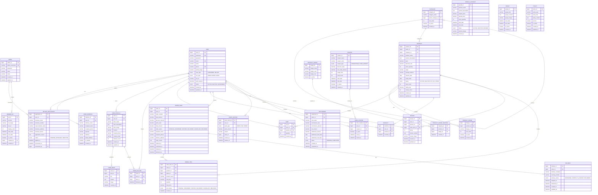

```mermaid
erDiagram
    %% 사용자 관련 테이블
    ADMIN {
        bigint admin_id PK
        varchar admin_username UK
        varchar password
        varchar name
        varchar email
        datetime created_at
        datetime updated_at
    }

    USER {
        bigint user_id PK
        varchar username UK
        varchar password
        varchar email UK
        varchar name
        varchar phone UK
        varchar profile_image
        enum user_type "CONSUMER, SELLER"
        enum sns_type "NONE, NAVER, KAKAO"
        varchar sns_id
        decimal point_balance
        enum status "ACTIVE, INACTIVE, SUSPENDED"
        datetime created_at
        datetime updated_at
    }

    USER_ADDRESS {
        bigint address_id PK
        bigint user_id FK
        varchar address_name
        varchar recipient_name
        varchar recipient_phone
        varchar zipcode
        varchar address
        varchar detail_address
        boolean is_default
        datetime created_at
    }

    %% 판매자 관련 테이블
    SELLER_APPLICATION {
        bigint application_id PK
        bigint user_id FK
        varchar business_name
        varchar business_number
        varchar representative_name
        varchar business_address
        varchar business_phone
        text application_reason
        enum status "PENDING, APPROVED, REJECTED"
        datetime applied_at
        datetime processed_at
        bigint processed_by FK
    }

    FARM_PROFILE {
        bigint farm_id PK
        bigint user_id FK
        varchar farm_name
        text farm_description
        varchar farm_image
        varchar location
        varchar contact_phone
        varchar contact_email
        int follower_count
        datetime created_at
        datetime updated_at
    }

    FARM_NEWS {
        bigint news_id PK
        bigint farm_id FK
        varchar title
        text content
        varchar image
        datetime created_at
    }

    FARM_FOLLOW {
        bigint follow_id PK
        bigint user_id FK
        bigint farm_id FK
        datetime followed_at
    }

    %% 카테고리 및 상품 관련 테이블
    CATEGORY {
        bigint category_id PK
        varchar category_name
        bigint parent_category_id FK
        int sort_order
        boolean is_active
        datetime created_at
    }

    PRODUCT {
        bigint product_id PK
        bigint seller_id FK
        bigint category_id FK
        varchar product_name
        text product_description
        decimal price
        decimal discount_rate
        int stock_quantity
        varchar origin
        varchar storage_method
        date harvest_date
        date expiry_date
        enum status "ACTIVE, INACTIVE, OUT_OF_STOCK"
        int view_count
        decimal rating_avg
        int review_count
        datetime created_at
        datetime updated_at
    }

    PRODUCT_IMAGE {
        bigint image_id PK
        bigint product_id FK
        varchar image_url
        int sort_order
        boolean is_main
        datetime created_at
    }

    PRODUCT_BADGE {
        bigint badge_id PK
        varchar badge_name
        varchar badge_color
        varchar badge_icon
        boolean is_active
    }

    PRODUCT_BADGE_MAPPING {
        bigint mapping_id PK
        bigint product_id FK
        bigint badge_id FK
        datetime created_at
    }

    %% 특가 상품 테이블
    SPECIAL_PRODUCT {
        bigint special_id PK
        varchar product_name
        text product_description
        decimal original_price
        decimal special_price
        int stock_quantity
        datetime start_date
        datetime end_date
        enum status "ACTIVE, INACTIVE, EXPIRED"
        varchar product_image
        datetime created_at
    }

    %% 장바구니 및 찜 테이블
    CART {
        bigint cart_id PK
        bigint user_id FK
        bigint product_id FK
        int quantity
        datetime created_at
    }

    WISHLIST {
        bigint wishlist_id PK
        bigint user_id FK
        bigint product_id FK
        datetime created_at
    }

    %% 주문 관련 테이블
    ORDER_MAIN {
        bigint order_id PK
        bigint user_id FK
        varchar order_number UK
        decimal total_amount
        decimal discount_amount
        decimal point_used
        decimal final_amount
        enum order_status "PENDING, CONFIRMED, SHIPPED, DELIVERED, CANCELLED, REFUNDED"
        varchar recipient_name
        varchar recipient_phone
        varchar delivery_address
        text order_memo
        datetime ordered_at
        datetime confirmed_at
        datetime shipped_at
        datetime delivered_at
    }

    ORDER_ITEM {
        bigint order_item_id PK
        bigint order_id FK
        bigint product_id FK
        bigint seller_id FK
        varchar product_name
        decimal unit_price
        int quantity
        decimal total_price
        enum item_status "PENDING, CONFIRMED, SHIPPED, DELIVERED, CANCELLED, REFUNDED"
        datetime created_at
    }

    %% 배송 관련 테이블
    DELIVERY {
        bigint delivery_id PK
        bigint order_id FK
        varchar delivery_company
        varchar tracking_number
        enum delivery_status "PREPARING, SHIPPED, IN_TRANSIT, DELIVERED"
        datetime shipped_at
        datetime delivered_at
        datetime created_at
        datetime updated_at
    }

    %% 리뷰 테이블
    REVIEW {
        bigint review_id PK
        bigint user_id FK
        bigint product_id FK
        bigint order_item_id FK
        int rating
        text review_content
        varchar review_image
        datetime created_at
        datetime updated_at
    }

    %% 쿠폰 및 포인트 테이블
    COUPON {
        bigint coupon_id PK
        varchar coupon_name
        varchar coupon_code UK
        enum coupon_type "PERCENTAGE, FIXED_AMOUNT"
        decimal discount_value
        decimal min_order_amount
        int usage_limit
        int used_count
        datetime start_date
        datetime end_date
        boolean is_active
        datetime created_at
    }

    USER_COUPON {
        bigint user_coupon_id PK
        bigint user_id FK
        bigint coupon_id FK
        boolean is_used
        datetime used_at
        datetime issued_at
    }

    POINT_HISTORY {
        bigint point_history_id PK
        bigint user_id FK
        enum point_type "EARN, USE, EXPIRE"
        decimal point_amount
        varchar reason
        bigint order_id FK
        datetime created_at
        datetime expires_at
    }

    %% 정산 테이블
    SETTLEMENT {
        bigint settlement_id PK
        bigint seller_id FK
        decimal total_sales
        decimal commission_rate
        decimal commission_amount
        decimal vat_amount
        decimal settlement_amount
        date settlement_start_date
        date settlement_end_date
        enum status "PENDING, COMPLETED"
        datetime created_at
        datetime completed_at
    }

    %% 광고 테이블
    BANNER_AD {
        bigint ad_id PK
        varchar ad_title
        varchar ad_image
        varchar ad_url
        int display_order
        datetime start_date
        datetime end_date
        boolean is_active
        bigint created_by FK
        datetime created_at
    }

    %% 팝업 테이블
    POPUP {
        bigint popup_id PK
        varchar popup_title
        text popup_content
        varchar popup_image
        datetime start_date
        datetime end_date
        boolean is_active
        datetime created_at
    }

    %% 정책 및 약관 테이블
    POLICY {
        bigint policy_id PK
        varchar policy_type
        varchar policy_title
        text policy_content
        varchar version
        boolean is_active
        datetime created_at
        datetime updated_at
    }

    %% 관계 정의
    USER ||--o{ USER_ADDRESS : has
    USER ||--o{ SELLER_APPLICATION : applies
    USER ||--o{ FARM_PROFILE : owns
    USER ||--o{ FARM_FOLLOW : follows
    USER ||--o{ CART : has
    USER ||--o{ WISHLIST : has
    USER ||--o{ ORDER_MAIN : places
    USER ||--o{ REVIEW : writes
    USER ||--o{ USER_COUPON : receives
    USER ||--o{ POINT_HISTORY : has

    ADMIN ||--o{ SELLER_APPLICATION : processes
    ADMIN ||--o{ BANNER_AD : creates

    FARM_PROFILE ||--o{ FARM_NEWS : publishes
    FARM_PROFILE ||--o{ FARM_FOLLOW : receives

    CATEGORY ||--o{ CATEGORY : contains
    CATEGORY ||--o{ PRODUCT : categorizes

    PRODUCT ||--o{ PRODUCT_IMAGE : has
    PRODUCT ||--o{ PRODUCT_BADGE_MAPPING : has
    PRODUCT ||--o{ CART : contains
    PRODUCT ||--o{ WISHLIST : contains
    PRODUCT ||--o{ ORDER_ITEM : includes
    PRODUCT ||--o{ REVIEW : receives

    PRODUCT_BADGE ||--o{ PRODUCT_BADGE_MAPPING : applied_to

    ORDER_MAIN ||--o{ ORDER_ITEM : contains
    ORDER_MAIN ||--o{ DELIVERY : has

    COUPON ||--o{ USER_COUPON : issued_as

    USER ||--o{ SETTLEMENT : receives
```